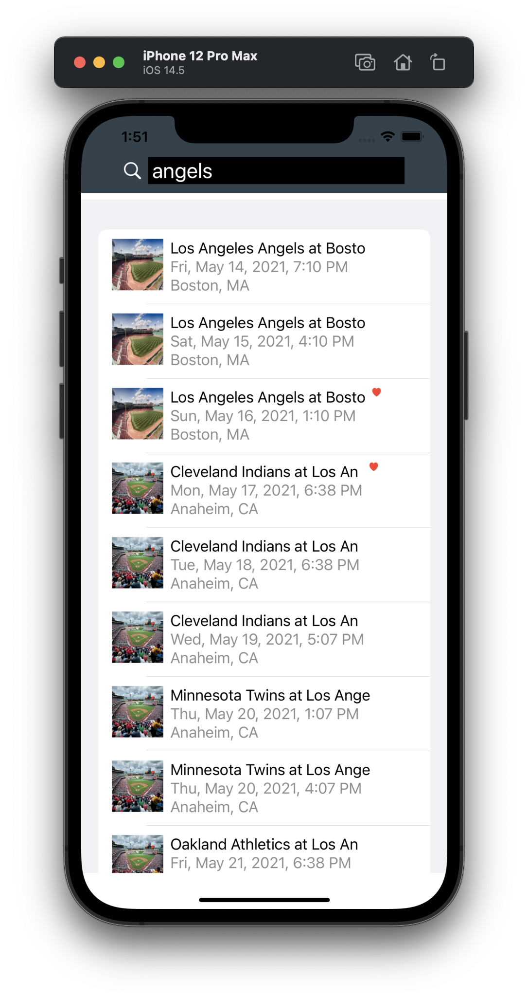
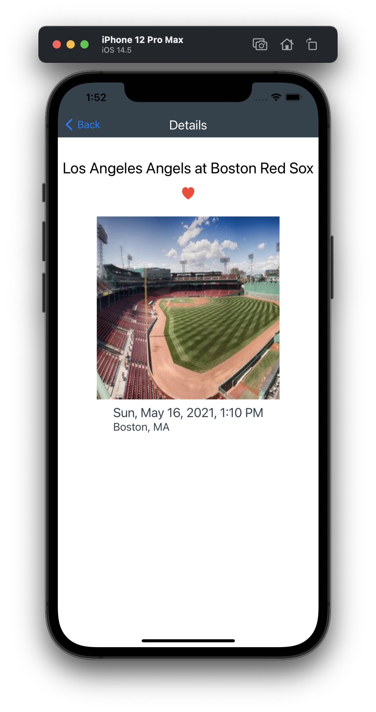

# seatGeekSUCombine

## Implementation
- Designed by an MVVM Model with SwiftUI and Combine.
- Connect to API:
https://api.seatgeek.com/2/events?client_id=<API Key>&q=<event name>
- User interface with SwiftUI and the update backend data with Observed Object & Combine.

### View
- <b>SearchEventView.swift</b> - 
Search field and Display search result Events list
- <b>EventDetailsView.swift</b> - 
Display Event Details 
- <b>URLImage.swift</b> - 
UI liverary component for display and download Images from URL in Asynchronous

### ViewModel & Presentor
- <b>SearchEventsViewModel.swift</b> -
View Model for SearchEventsView. This is call API fetcher and received data with Combine subscribe. 
- <b>OrientationInfo.swift</b> -
Objservable View Model for the device orientation.
- <b>ImageLoader.swift</b> -
Download and Update logic for the image data of URLImage 

### Model
- <b>EventsResponse.swift</b> -
Events Data Model for SeatGeek API

### Events data fetcher for SeatGeek API
- <b>SeatGeekAPIFetcher.swift</b> -
Fetch events data from API with URLSession.datataskPublisher & Combine

### Helpers
- <b>ExtensionDateString.swift</b> -
String Extension for the date format
- <b>Constants.swift</b> -
Define constants table
